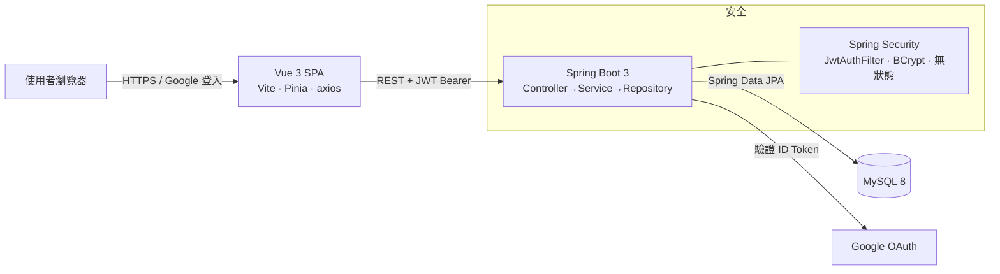

# 歐洲自助遊 ✈️ — 前後端分離全端作品

一個可實際運行的旅遊行程預訂平台，採 **前端 / 後端 / 資料庫三層分離** 架構，前端以 **AJAX（axios）** 串接後端 RESTful API，支援 **帳號密碼登入** 與 **Google 第三方登入**。適合作為應徵「全端工程師」的作品集專案。

```
瀏覽器 (Vue 3 SPA)  ──AJAX/JWT──▶  Spring Boot REST API  ──JPA──▶  MySQL
```



## 🧱 技術棧

| 層 | 技術 |
| --- | --- |
| 前端 | Vue 3 (Composition API)、Vite、Vue Router、Pinia、axios、Tailwind CSS |
| 後端 | Spring Boot 3、Spring Security、Spring Data JPA、**MyBatis-Plus**、JWT (jjwt)、Google API Client |
| 資料庫 | MySQL 8（utf8mb4）|
| 驗證 | JWT（Bearer Token）＋ BCrypt 密碼雜湊 ＋ Google ID Token 驗證 |

## 📁 專案結構

```
voyago-fullstack/
├── 前端/        Vue 3 + Vite 單頁應用（SPA）
│   └── src/  views(頁面) / components(元件) / api(axios) / stores(Pinia) / router
├── 後端/        Spring Boot REST API
│   └── src/main/java/com/voyago/
│        entity(資料表) / repository(DAO) / service(商業邏輯)
│        controller(API) / security(JWT) / config(安全/CORS) / dto
├── 資料庫/      MySQL 建表與種子資料 SQL
│   ├── 01_schema.sql   建立 voyago 資料庫與 4 張資料表
│   └── 02_seed.sql     灌入 10 條歐洲行程、示範會員與訂單
└── README.md
```

四張資料表全部串接：`member`（會員）、`route`（行程）、`booking`（訂單，外鍵連 member+route）、`message`（客服對話，外鍵連 member）。

---

## 🚀 啟動步驟（前後端分離，需各自啟動）

> 需求環境：**JDK 17+**、**Maven 3.8+**、**Node.js 18+**、**MySQL 8**。

### 1️⃣ 資料庫

```bash
mysql -u root -p < 資料庫/01_schema.sql
mysql -u root -p < 資料庫/02_seed.sql
```

### 2️⃣ 後端（http://localhost:8080）

```bash
cd 後端
# 視情況設定資料庫帳密（預設 root/root）
#   Windows: set DB_USER=root & set DB_PASSWORD=你的密碼
#   macOS/Linux: export DB_USER=root DB_PASSWORD=你的密碼
mvn spring-boot:run
```

### 3️⃣ 前端（http://localhost:5173）

```bash
cd 前端
npm install
npm run dev
```

開啟瀏覽器到 **http://localhost:5173** 即可使用。前端開發伺服器已設定把 `/api` 代理到後端 8080 埠，免處理 CORS。

> 💡 Windows 使用者可直接雙擊 `後端/啟動後端.bat` 與 `前端/啟動前端.bat` 一鍵啟動。

### 🔑 體驗帳號

| 角色 | Email | 密碼 |
| --- | --- | --- |
| 一般會員 | `demo@voyago.com` | `password123` |
| 客服人員 | `staff@voyago.com` | `staff1234` |

登入頁已預先填入會員帳號，可直接登入體驗預訂與訂單流程。

---

## 🔐 啟用 Google 登入（選用）

1. 到 [Google Cloud Console](https://console.cloud.google.com/apis/credentials) 建立「OAuth 用戶端 ID（網頁應用程式）」。
2. 在「已授權的 JavaScript 來源」加入 `http://localhost:5173`。
3. 取得用戶端 ID 後填入兩處：
   - 前端 `前端/.env` → `VITE_GOOGLE_CLIENT_ID=你的ID.apps.googleusercontent.com`
   - 後端啟動環境變數 → `GOOGLE_CLIENT_ID=你的ID.apps.googleusercontent.com`
4. 重新啟動前後端，登入/註冊頁就會出現 Google 按鈕。

> 未設定時，前端會顯示提示、其餘帳號密碼功能完全正常，不影響展示。

---

## 📡 API 一覽

| 方法 | 路徑 | 說明 | 需登入 |
| --- | --- | --- | --- |
| POST | `/api/auth/register` | 註冊（回傳 JWT）| |
| POST | `/api/auth/login` | 帳密登入 | |
| POST | `/api/auth/google` | Google 登入（驗證 ID Token）| |
| GET | `/api/auth/me` | 取得當前會員 | |
| GET | `/api/routes?q=&tag=&sort=` | 行程列表（搜尋／標籤／排序）| |
| GET | `/api/routes/page?page=&size=` | 行程分頁查詢（回傳總頁數）| |
| GET | `/api/routes/{slug}` | 單一行程 | |
| GET | `/api/bookings` | 我的訂單 | ✅ |
| POST | `/api/bookings` | 建立訂單 | ✅ |
| GET | `/api/chat` | 我的客服訊息 | ✅ |
| POST | `/api/chat` | 送出訊息 | ✅ |

## 💬 面試可談的設計重點

- **前後端分離**：Vue SPA 與 Spring Boot 各自獨立部署，以 JSON over HTTP 溝通，前端用 axios 攔截器統一帶上 JWT 與處理錯誤。
- **無狀態驗證**：後端 `SessionCreationPolicy.STATELESS`，以 JWT 取代 Session；`JwtAuthFilter` 解析 Token 後注入 `SecurityContext`。
- **第三方登入**：以 Google Identity Services 在前端取得 ID Token，後端用 `GoogleIdTokenVerifier` 驗證簽章與 audience，首次登入自動建立帳號。
- **分層架構**：Controller → Service → Repository 清楚分層，DTO 與 Entity 分離避免敏感欄位外洩（如密碼雜湊）。
- **關聯式資料模型**：四表透過外鍵串接，JPA 關聯映射 + 自訂 JPQL 查詢支援搜尋與篩選。

## 🧪 工程實務（Engineering Practices）

**自動化測試**：後端以 JUnit 5 + Mockito 撰寫單元測試（`JwtUtilTest`、`RouteServiceTest`、`BookingServiceTest`），涵蓋 JWT 簽發驗證、查詢排序、訂單金額計算與權限檢查。

```bash
cd 後端 && mvn test
```

**CI/CD**：`.github/workflows/ci.yml`（GitHub Actions）在每次 push／PR 自動建置並測試前後端，確保主分支永遠可建置。

**API 文件**：整合 springdoc-openapi，啟動後端後開 <http://localhost:8080/swagger-ui.html> 即可看到互動式 API 文件並直接試打。

**容器化一鍵啟動**：根目錄 `docker-compose.yml` 一個指令拉起前端 + 後端 + MySQL：

```bash
cp .env.example .env    # 填入你的密鑰（JWT_SECRET 與 Google client id）
docker compose up --build
# 前端 http://localhost   後端 http://localhost:8080   Swagger /swagger-ui.html
# 健康檢查 http://localhost:8080/actuator/health
```

特色：
- MySQL 啟用 volume 持久化；首次啟動自動執行 `資料庫/01_schema.sql` 與 `02_seed.sql`。
- Nginx 反代 `/api` → 後端，前端走同源請求免處理 CORS。
- 後端 Dockerfile 拆 Maven 依賴層（rebuild 從 ~2min 縮到 ~20s）、以 non-root 跑、JVM 自動感知容器記憶體。
- Nginx 開 gzip、設安全標頭（CSP/X-Frame-Options/Referrer-Policy 等）、`/assets/*` 一年快取。

## 🧠 設計決策（Design Decisions）

- **為何前後端分離**：前端可獨立部署到 CDN（Vercel/Netlify），後端純 API 可水平擴展；兩者以 JSON 合約溝通，團隊能並行開發。
- **為何用 JWT 而非 Session**：無狀態驗證讓後端可任意擴充節點、不需共享 Session store；Token 以 `Authorization: Bearer` 攜帶，避免 CSRF。
- **DTO 與 Entity 分離**：API 只回傳 DTO，密碼雜湊等敏感欄位永不外洩到前端。
- **第三方登入安全**：Google ID Token 在後端用 `GoogleIdTokenVerifier` 驗證簽章與 audience，不信任前端傳入的身分宣告。
- **可移植性**：資料庫連線、JWT 密鑰、CORS 來源、Google Client ID 全部走環境變數，本機與雲端零改碼切換。
- **分層與動態查詢**：採 Controller → Service(介面+Impl) → DAO 分層；`RouteDao` 以 JPA Criteria API 組動態複合查詢，支援分頁（setFirstResult/setMaxResults）與 count 計數、由 Service 計算總頁數。
- **同時掌握兩種 ORM**：Booking/Message/Member 模組用 **Spring Data JPA + Criteria API**；Route 模組改用 **MyBatis-Plus**（`BaseMapper` + `LambdaQueryWrapper` 動態查詢 + `PaginationInnerInterceptor` 分頁外掛），展示對主流 ORM 的掌握。

---

© 歐洲自助遊 — 全端示範作品。行程圖片來源：Unsplash。
