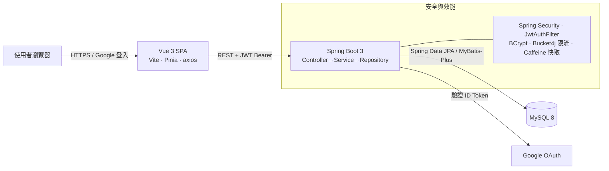
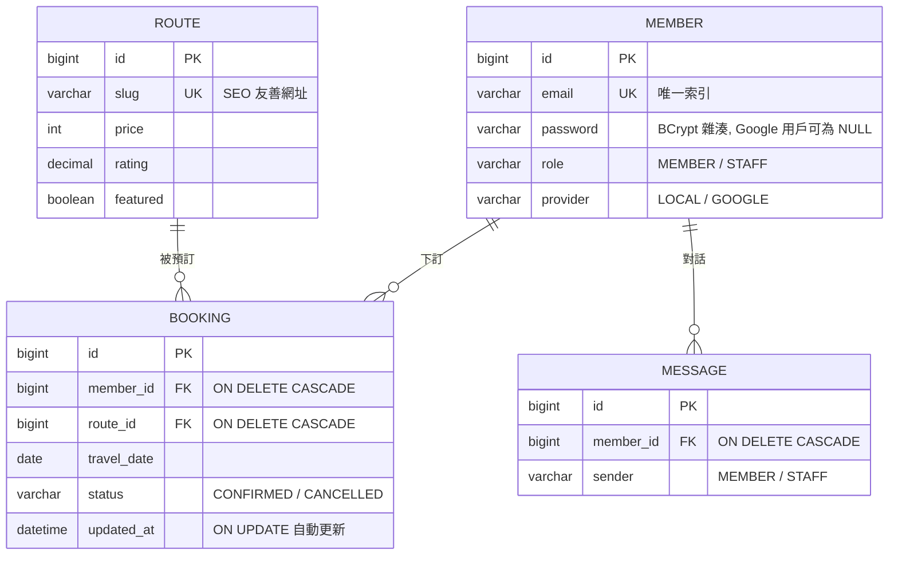

# Voyago 歐洲自助遊 ✈️ — 前後端分離全端作品

[](https://github.com/kensong0518/voyago-fullstack/actions/workflows/ci.yml)
[](https://gleeful-valkyrie-494d4e.netlify.app)


一個**可實際運行、可線上體驗**的旅遊行程預訂平台。採 **前端 / 後端 / 資料庫三層分離** 架構：Vue 3 SPA 以 **AJAX（axios）** 串接 Spring Boot **RESTful API**，資料持久化於 MySQL；支援 **帳號密碼登入** 與 **Google 第三方登入**，並涵蓋 **單元測試、CI/CD、容器化、雲端部署、快取、流量限制** 等工程實務。

> 🌐 **線上展示**：<https://gleeful-valkyrie-494d4e.netlify.app>
> 展示站運行於「純前端示範模式」——資料暫存於瀏覽器（localStorage），無需後端即可體驗完整流程（註冊、登入、搜尋行程、下訂單、客服對話、會員管理）。完整三層架構請見下方[本機啟動](#-快速開始)或 [雲端部署](#-雲端部署)。

```
瀏覽器 (Vue 3 SPA)  ──AJAX / JWT──▶  Spring Boot REST API  ──JPA / MyBatis-Plus──▶  MySQL 8
```



---

## 📑 目錄

- [專案亮點](#-專案亮點)
- [技術棧](#-技術棧)
- [功能總覽](#-功能總覽)
- [專案結構](#-專案結構)
- [快速開始](#-快速開始)
- [體驗帳號](#-體驗帳號)
- [API 一覽](#-api-一覽)
- [資料庫設計](#-資料庫設計)
- [安全性設計](#-安全性設計)
- [效能優化](#-效能優化)
- [自動化測試與 CI/CD](#-自動化測試與-cicd)
- [雲端部署](#-雲端部署)
- [設計決策](#-設計決策)
- [面試可談的設計重點](#-面試可談的設計重點)

---

## ✨ 專案亮點

| 面向 | 內容 |
| --- | --- |
| **完整三層架構** | Vue 3 SPA ↔ Spring Boot REST API ↔ MySQL，四張資料表以外鍵全部串接 |
| **雙 ORM 實戰** | 同專案展示 Spring Data JPA + Criteria API 與 MyBatis-Plus 兩套主流 ORM |
| **無狀態驗證** | JWT Bearer Token + BCrypt + Google ID Token 後端驗證，水平擴展友善 |
| **角色權限** | `@EnableMethodSecurity` + `@PreAuthorize`：STAFF 專屬會員管理（搜尋／分頁／新增／刪除） |
| **API 防護** | Bucket4j 對 `/api/auth/**` 做 per-IP 限流（5 次/分），防暴力破解 |
| **查詢效能** | Caffeine 快取（5 分 TTL）、複合索引、LAZY + fetch join 解 N+1 |
| **測試與 CI** | JUnit 5 + Mockito 單元測試；GitHub Actions 每次 push 自動建置前後端 |
| **容器化** | docker-compose 一鍵起前端 + 後端 + MySQL；多階段建置、non-root、健康檢查鏈 |
| **可展示性** | 前端內建「示範模式」：後端未部署也能完整體驗，已上線 Netlify |

---

## 🧱 技術棧

| 層 | 技術 |
| --- | --- |
| 前端 | Vue 3（Composition API）、Vite、Vue Router、Pinia、axios、Tailwind CSS |
| 後端 | Spring Boot 3、Spring Security、Spring Data JPA、**MyBatis-Plus**、JWT（jjwt）、Google API Client、Bucket4j、Caffeine、Actuator |
| 資料庫 | MySQL 8（utf8mb4、InnoDB、外鍵 + 複合索引） |
| 驗證 | JWT（Bearer Token）＋ BCrypt 密碼雜湊 ＋ Google ID Token 後端驗證 |
| 測試 | JUnit 5、Mockito、Maven Surefire |
| DevOps | Docker / docker-compose、Nginx、GitHub Actions、Netlify、Render Blueprint（`render.yaml`） |
| API 文件 | springdoc-openapi（Swagger UI） |

---

## 🧭 功能總覽

**一般會員**
- 註冊 / 登入（帳密或 Google）、JWT 自動續帶、登出
- 行程瀏覽：關鍵字搜尋、標籤篩選、多種排序（精選／價格／評分／天數）、分頁
- 行程詳情：圖庫、行程特色、每日安排
- 預訂行程：選日期與人數、自動計算總價、過去日期擋下
- 會員中心：訂單查詢與取消、個人資料編輯、**刪除帳號（雙重確認）**
- 線上客服：訊息對話介面

**客服／管理人員（STAFF）**
- 會員管理面板：關鍵字搜尋（姓名/Email/電話）、分頁列表
- 新增會員（含角色指定 MEMBER / STAFF、密碼強度規則）
- 刪除會員（後端阻擋 STAFF 刪除自己，防鎖死）

**工程面**
- 前端「示範模式」（`VITE_DEMO_ONLY`）：完全離線可展示，頁面上下方自動顯示展示聲明橫幅
- 後端優雅降級：前端 axios 攔截器統一處理 401（清 token 導回登入）
- 健康檢查：`/actuator/health`（供 Docker healthcheck 與雲端平台探測）

---

## 📁 專案結構

```
voyago-fullstack/
├── 前端/                Vue 3 + Vite 單頁應用（SPA）
│   ├── src/views/       頁面（首頁/行程/詳情/登入/註冊/會員中心/客服）
│   ├── src/components/  元件（NavBar、RouteCard、DemoBanner…）
│   ├── src/api/         axios 封裝（攔截器、示範模式 fallback）
│   ├── src/stores/      Pinia（auth 狀態、isStaff getter）
│   ├── Dockerfile       多階段建置 → Nginx 服務靜態檔
│   └── nginx.conf       gzip、安全標頭、/api 反代、資產快取
├── 後端/                Spring Boot REST API
│   ├── src/main/java/com/voyago/
│   │   ├── entity/      JPA 實體（Member/Route/Booking/Message）
│   │   ├── repository/  Spring Data JPA + Criteria DAO / MyBatis-Plus Mapper
│   │   ├── service/     商業邏輯（介面 + Impl、交易邊界、快取）
│   │   ├── controller/  REST API（DTO 進出，不外洩 Entity）
│   │   ├── security/    JwtAuthFilter、AuthRateLimitFilter（Bucket4j）
│   │   ├── config/      SecurityConfig、CacheConfig、全域例外處理
│   │   └── dto/         請求/回應物件（Bean Validation）
│   ├── src/test/java/   JUnit 5 + Mockito 單元測試
│   └── Dockerfile       Maven 依賴層快取、JRE Alpine、non-root
├── 資料庫/
│   ├── 01_schema.sql    建庫建表（外鍵、複合索引、utf8mb4）
│   └── 02_seed.sql      10 條歐洲行程 + 體驗帳號 + 示範訂單
├── docker-compose.yml   一鍵啟動三層（volume、初始化 SQL、健康檢查鏈）
├── render.yaml          Render Blueprint：一鍵部署後端到免費雲端
├── netlify.toml         Netlify 設定：/api 反代、示範模式開關
├── DEPLOY.md            雲端部署逐步指南（TiDB Cloud → Render → Netlify）
└── .github/workflows/ci.yml   CI：自動建置 + 測試前後端
```

四張資料表全部串接：`member`（會員）、`route`（行程）、`booking`（訂單，外鍵連 member + route）、`message`（客服對話，外鍵連 member）。

---

## 🚀 快速開始

> 需求環境：JDK 17+、Maven 3.8+（或用內附 `mvnw`）、Node.js 18+、MySQL 8。

### 方式一：Docker 一鍵啟動（最快）

```bash
cp .env.example .env     # 填入 MYSQL_ROOT_PASSWORD、JWT_SECRET（Google ID 選填）
docker compose up --build
# 前端  http://localhost
# 後端  http://localhost:8080（Swagger: /swagger-ui.html）
# 健康  http://localhost:8080/actuator/health
```

MySQL 首次啟動自動執行 `資料庫/` 內的建表與種子 SQL，並以 volume 持久化。

### 方式二：三層各自啟動

```bash
# 1️⃣ 資料庫
mysql -u root -p < 資料庫/01_schema.sql
mysql -u root -p < 資料庫/02_seed.sql

# 2️⃣ 後端（http://localhost:8080）— 預設帳密 root / 123456，可用環境變數覆蓋
cd 後端
# Windows:      set DB_USER=root & set DB_PASSWORD=你的密碼
# macOS/Linux:  export DB_USER=root DB_PASSWORD=你的密碼
mvn spring-boot:run

# 3️⃣ 前端（http://localhost:5173，已代理 /api → 8080 免 CORS）
cd 前端
npm install
npm run dev
```

💡 Windows 可直接雙擊 `後端/啟動後端.bat` 與 `前端/啟動前端.bat`。

### 方式三：純前端示範模式（不需後端與資料庫）

```bash
cd 前端
VITE_DEMO_ONLY=true npm run dev
```

所有 API 改用內建示範資料（localStorage 持久化），與線上 Demo 行為一致——適合快速展示 UI/UX。

---

## 🔑 體驗帳號

| 角色 | Email | 密碼 | 能做什麼 |
| --- | --- | --- | --- |
| 一般會員 | `demo@voyago.com` | `password123` | 預訂、訂單、客服、編輯資料 |
| 客服人員 | `staff@voyago.com` | `staff1234` | 以上全部 ＋ 會員管理面板 |

登入頁已預填會員帳號，可直接體驗。

### 🔐 啟用 Google 登入（選用）

1. 到 [Google Cloud Console](https://console.cloud.google.com/apis/credentials) 建立「OAuth 用戶端 ID（網頁應用程式）」，授權來源加入 `http://localhost:5173`。
2. 填入兩處：前端 `前端/.env` → `VITE_GOOGLE_CLIENT_ID=...`；後端環境變數 `GOOGLE_CLIENT_ID=...`。
3. 重啟前後端即出現 Google 按鈕。未設定時按鈕自動隱藏，其餘功能不受影響。

---

## 📡 API 一覽

> 啟動後端後可開 **Swagger UI**（`http://localhost:8080/swagger-ui.html`）互動式試打全部端點。

### 驗證（`/api/auth/**` 受 Bucket4j 限流：每 IP 5 次/分鐘）

| 方法 | 路徑 | 說明 | 權限 |
| --- | --- | --- | --- |
| POST | `/api/auth/register` | 註冊（密碼需 8+ 字元含英數，回傳 JWT） | 公開 |
| POST | `/api/auth/login` | 帳密登入 | 公開 |
| POST | `/api/auth/google` | Google 登入（後端驗證 ID Token） | 公開 |
| GET | `/api/auth/me` | 取得當前會員 | 登入 |

### 行程（讀取走 Caffeine 快取）

| 方法 | 路徑 | 說明 | 權限 |
| --- | --- | --- | --- |
| GET | `/api/routes?q=&tag=&sort=` | 行程列表（搜尋／標籤／排序） | 公開 |
| GET | `/api/routes/page?page=&size=` | 分頁查詢（回傳總頁數） | 公開 |
| GET | `/api/routes/{slug}` | 單一行程 | 公開 |

### 訂單

| 方法 | 路徑 | 說明 | 權限 |
| --- | --- | --- | --- |
| GET | `/api/bookings` | 我的訂單（fetch join 避免 N+1） | 登入 |
| GET | `/api/bookings/page` | 我的訂單（分頁） | 登入 |
| POST | `/api/bookings` | 建立訂單（過去日期/超量人數擋下） | 登入 |
| DELETE | `/api/bookings/{id}` | 取消訂單 | 登入（本人） |

### 客服

| 方法 | 路徑 | 說明 | 權限 |
| --- | --- | --- | --- |
| GET | `/api/chat` | 我的客服訊息 | 登入 |
| POST | `/api/chat` | 送出訊息 | 登入 |

### 會員

| 方法 | 路徑 | 說明 | 權限 |
| --- | --- | --- | --- |
| PUT | `/api/members/me` | 編輯個人資料 | 登入 |
| DELETE | `/api/members/me` | 刪除自己的帳號 | 登入 |
| GET | `/api/members?q=&page=&size=` | 會員搜尋 + 分頁 | **STAFF** |
| POST | `/api/members` | 新增會員（可指定角色） | **STAFF** |
| DELETE | `/api/members/{id}` | 刪除會員（禁止刪除自己） | **STAFF** |

### 維運

| 方法 | 路徑 | 說明 |
| --- | --- | --- |
| GET | `/actuator/health` | 健康檢查（只暴露 health/info，不洩漏內部資訊） |

---

## 🗄 資料庫設計



**索引策略**（依查詢模式設計，非無腦全加）：

| 表 | 索引 | 服務的查詢 |
| --- | --- | --- |
| route | `(featured, reviews)` 複合 | 首頁精選排序 |
| route | `price` / `rating` / `days` / `country` | 列表排序與篩選 |
| booking | `(member_id, created_at DESC)` 複合 | 會員中心訂單列表（含排序） |
| booking | `travel_date` / `status` | 報表與狀態篩選 |
| message | `(member_id, created_at)` 複合 | 客服對話依時序載入 |

---

## 🔐 安全性設計

- **無狀態驗證**：`SessionCreationPolicy.STATELESS`，JWT 取代 Session；`JwtAuthFilter` 解析 Bearer Token 注入 `SecurityContext`，避免 CSRF、後端可水平擴展。
- **密碼安全**：BCrypt 雜湊儲存；註冊密碼規則「8+ 字元、需含英文與數字」前後端雙重驗證。
- **登入防暴力破解**：`AuthRateLimitFilter`（Bucket4j token bucket）對 `/api/auth/login|register|google` 做 per-IP 限流（5 次/分），支援 `X-Forwarded-For`。
- **方法級授權**：`@EnableMethodSecurity` + `@PreAuthorize("hasRole('STAFF')")`，管理端點不靠前端隱藏、由後端強制。
- **第三方登入不信任前端**：Google ID Token 由後端 `GoogleIdTokenVerifier` 驗證簽章與 audience，首次登入自動建立帳號。
- **DTO 與 Entity 分離**：API 只回傳 DTO，密碼雜湊等敏感欄位永不外洩。
- **錯誤處理不洩漏內部**：全域例外處理器記 log 但不回傳 stack trace；Actuator 只開 health/info。
- **前端防護標頭**：Nginx 設 CSP、`X-Frame-Options`、`Referrer-Policy`、`X-Content-Type-Options`。
- **密鑰零硬編碼**：DB 帳密、`JWT_SECRET`、Google Client ID 全部走環境變數（`.env.example` 列出清單）。

## ⚡ 效能優化

- **查詢快取**：行程讀取以 Caffeine（500 筆、5 分 TTL）+ Spring Cache 抽象快取，熱門列表不重複打 DB。
- **N+1 消除**：`Booking.route` 改 `LAZY`，列表查詢用 Criteria `fetch join` 一次帶出關聯。
- **交易邊界**：Service 層 `@Transactional(readOnly = true)` 為預設、寫入方法個別開寫交易。
- **防失控查詢**：客服訊息查詢設 hard limit（500 筆）。
- **前端打包**：Vite `manualChunks` 把 vue 生態與 axios 拆 chunk，搭配 Nginx `/assets/*` 一年 immutable 快取，改版只需重抓變動的 chunk。
- **圖片載入**：列表圖 `loading="lazy"`、首屏主圖 `fetchpriority="high"`。
- **Docker 建置**：後端 Dockerfile 拆 Maven 依賴層（rebuild 從 ~2min → ~20s）、JRE Alpine 縮小映像、JVM 自動感知容器記憶體上限。

---

## 🧪 自動化測試與 CI/CD

```bash
cd 後端 && mvn test    # JUnit 5 + Mockito，8 個測試全綠
```

| 測試類 | 涵蓋 |
| --- | --- |
| `JwtUtilTest` | JWT 簽發與驗證、過期/竄改拒絕 |
| `RouteServiceTest` | 列表查詢、排序、slug 查詢、分頁總頁數 |
| `BookingServiceTest` | 訂單金額計算、過去日期驗證、權限檢查 |

**CI（GitHub Actions）**：每次 push / PR 自動執行——後端 `mvn verify`（編譯 + 測試 + 打包）、前端 `npm ci && npm run build`，並上傳測試報告與建置產物；同分支重複觸發自動取消舊任務（concurrency）。主分支保證永遠可建置。

---

## ☁️ 雲端部署

本專案支援「**零成本**」完整上雲，所有設定檔已備好：

| 元件 | 平台 | 設定檔 |
| --- | --- | --- |
| 前端 | Netlify（免費） | `netlify.toml`（`/api` 反代後端、SPA fallback、快取/安全標頭） |
| 後端 | Render（免費，Blueprint 一鍵部署） | `render.yaml`（Docker、健康檢查、環境變數宣告、新加坡節點） |
| 資料庫 | TiDB Cloud Serverless（免費、MySQL 相容） | `資料庫/01_schema.sql` 直接匯入 |

逐步指南見 **[DEPLOY.md](DEPLOY.md)**。

**示範模式開關**：`netlify.toml` 的 `VITE_DEMO_ONLY` 設 `true` 時前端完全離線運作（目前線上 Demo 即此模式）；後端部署完成後改 `false` 並設定 `BACKEND_ORIGIN`，即切換為真實三層架構，前端程式碼零修改。

---

## 🧠 設計決策

- **為何前後端分離**：前端可獨立部署到 CDN（Netlify/Vercel），後端純 API 可水平擴展；兩者以 JSON 合約溝通，團隊能並行開發。
- **為何 JWT 而非 Session**：無狀態讓後端任意擴充節點、不需共享 Session store；Token 以 `Authorization: Bearer` 攜帶，天然免疫 CSRF。
- **為何同時用兩種 ORM**：Booking/Message/Member 用 Spring Data JPA + Criteria API（型別安全動態查詢、fetch join）；Route 用 MyBatis-Plus（`LambdaQueryWrapper` 動態查詢 + 分頁外掛）——展示對兩套主流 ORM 的實戰掌握與取捨理解。
- **為何做「示範模式」**：作品集網站常因「後端沒掛上去」變成死連結。前端內建 mock fallback（同一套 UI 與 API 介面），讓 Demo 永遠可用，也展示了「優雅降級」的工程思維。
- **限流放在 Filter 而非 Controller**：在進入 Spring MVC 之前就擋掉超量請求，省去無謂的反序列化與業務處理成本。
- **快取 TTL 取 5 分鐘**：行程資料低頻變動，5 分鐘是「即時性 vs DB 壓力」的折衷；寫入 API 若新增，配 `@CacheEvict` 即可主動失效。
- **可移植性**：所有環境差異（DB 連線、密鑰、CORS 來源）走環境變數，本機 → Docker → 雲端零改碼。

## 💬 面試可談的設計重點

1. **JWT 全流程**：簽發（登入/註冊/Google）→ 前端 axios 攔截器自動附帶 → `JwtAuthFilter` 驗證注入 → 401 統一處理登出。
2. **Google 登入的信任邊界**：為什麼 ID Token 必須在後端驗證、audience 檢查防什麼攻擊。
3. **N+1 問題現場**：怎麼發現（列表頁 SQL 數量）、兩種解法（EAGER vs fetch join）、為何選 LAZY + fetch join。
4. **限流演算法**：token bucket 與 fixed window 的差異、為何 per-IP、`X-Forwarded-For` 在反代後的必要性。
5. **複合索引設計**：`(member_id, created_at DESC)` 為什麼能同時吃 WHERE 與 ORDER BY、最左前綴原則。
6. **交易邊界**：`readOnly=true` 的實際效益（Hibernate flush 模式、資料庫層 hint）。
7. **容器化細節**：多階段建置的層快取策略、non-root 的安全意義、健康檢查鏈如何保證啟動順序。
8. **兩種 ORM 的取捨**：JPA 關聯映射 + Criteria 型別安全 vs MyBatis-Plus 的 SQL 掌控度與分頁外掛。

---

## 📄 授權

本專案以 [MIT License](LICENSE) 釋出，歡迎參考與延伸。

---

*本專案為個人作品集，線上展示站為示範性質、非真實旅遊預訂服務。*
