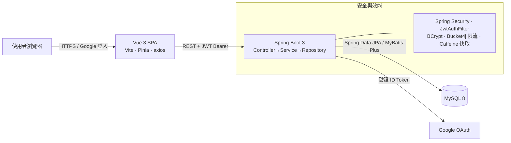
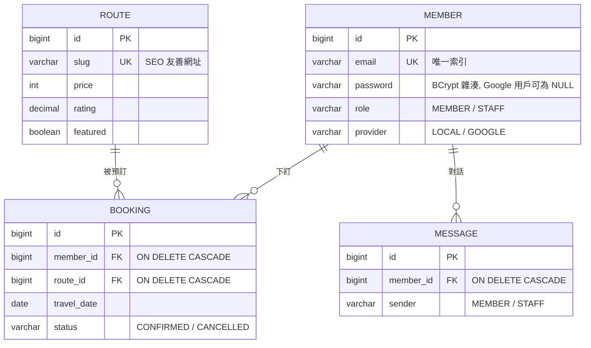

# Voyago — 歐洲自助遊預訂平台

[](https://github.com/kensong0518/voyago-fullstack/actions/workflows/ci.yml)
[](https://gleeful-valkyrie-494d4e.netlify.app)


這是我為了練習「一個功能從資料庫一路寫到畫面」而做的旅遊行程預訂平台。整包是前後端分離：Vue 3 的單頁前端用 axios 打 Spring Boot 的 REST API，資料存在 MySQL。除了 CRUD，我刻意把幾件在課堂範例裡常被跳過、但實務會遇到的東西補齊——帳密登入之外接了 Google 登入、密碼用 BCrypt、登入端點做了限流、熱門查詢加了快取、也寫了單元測試接 CI。

線上可以直接玩：<https://gleeful-valkyrie-494d4e.netlify.app>

> 展示站跑的是「純前端示範模式」。因為免費後端常常睡著、Demo 一睡就變死連結，所以我讓前端在沒有後端時改用內建假資料（存在 localStorage），註冊、登入、搜尋、下訂、客服對話這些流程照樣走得完。想看真正的三層架構，照下面的[本機啟動](#快速開始)跑就行。

```
瀏覽器 (Vue 3 SPA)  ──axios / JWT──▶  Spring Boot REST API  ──JPA / MyBatis-Plus──▶  MySQL 8
```



---

## 這個專案想證明什麼

作品集裡最容易被看穿的，就是「只有 CRUD、跑得動但沒有工程判斷」。所以我挑了幾個題目，重點不是功能多，而是每個決定背後有沒有理由：

- 登入不是只有帳密，還要能擋暴力破解、能接第三方、能水平擴展 → JWT + BCrypt + Bucket4j 限流 + Google ID Token 後端驗證。
- 查詢不是能跑就好，列表頁不能一打開就噴出十幾條 SQL → LAZY + fetch join 解 N+1，熱門資料上 Caffeine 快取。
- 權限不能靠前端藏按鈕 → 後端用 `@PreAuthorize` 強制，STAFF 專屬端點前端就算被繞過也擋得住。
- Demo 不能因為後端沒錢掛雲端就變死站 → 前端內建 mock fallback，同一套 UI 與 API 介面，離線也能展示。

---

## 技術棧

| 層 | 用了什麼 |
| --- | --- |
| 前端 | Vue 3（Composition API）、Vite、Vue Router、Pinia、axios、Tailwind CSS |
| 後端 | Spring Boot 3、Spring Security、Spring Data JPA、MyBatis-Plus、JWT（jjwt）、Google API Client、Bucket4j、Caffeine、Actuator |
| 資料庫 | MySQL 8（utf8mb4、InnoDB、外鍵 + 複合索引） |
| 驗證 | JWT Bearer Token、BCrypt 密碼雜湊、Google ID Token 後端驗證 |
| 測試 | JUnit 5、Mockito、Maven Surefire |
| 部署 | Docker / docker-compose、Nginx、GitHub Actions、Netlify、Render（`render.yaml`） |
| API 文件 | springdoc-openapi（Swagger UI） |

會在同一個專案裡同時用 Spring Data JPA 和 MyBatis-Plus，是想比較兩套 ORM 的手感（後面「設計取捨」有寫理由），不是為了炫技疊料。

---

## 功能

一般會員能做的事：註冊登入（帳密或 Google）、搜尋與篩選行程（關鍵字、標籤、多種排序、分頁）、看行程詳情（圖庫、每日安排）、下訂單（選日期人數、自動算總價、過去的日期會被擋）、在會員中心管訂單和個資、刪帳號要雙重確認，還有一個簡單的客服對話介面。

客服／管理人員（STAFF）多了一塊會員管理面板：可以用姓名 / Email / 電話搜尋會員、分頁瀏覽、新增會員（能指定角色、有密碼強度規則）、刪除會員。刪除會員時後端會擋住「刪掉自己」，避免把管理員全鎖死。

工程上幾個細節：前端的示範模式（`VITE_DEMO_ONLY`）會在頁面上下顯示聲明橫幅、axios 攔截器統一處理 401（清掉 token 導回登入）、後端開 `/actuator/health` 給 Docker 和雲端平台探活。

---

## 專案結構

```
voyago-fullstack/
├── 前端/                Vue 3 + Vite 單頁應用
│   ├── src/views/       各頁面（首頁 / 行程 / 詳情 / 登入 / 會員中心 / 客服）
│   ├── src/components/  元件（NavBar、RouteCard、DemoBanner…）
│   ├── src/api/         axios 封裝（攔截器、示範模式 fallback）
│   ├── src/stores/      Pinia（auth 狀態、isStaff getter）
│   ├── Dockerfile       多階段建置 → Nginx 服務靜態檔
│   └── nginx.conf       gzip、安全標頭、/api 反代、資產快取
├── 後端/                Spring Boot REST API
│   ├── src/main/java/com/voyago/
│   │   ├── entity/      JPA 實體（Member / Route / Booking / Message）
│   │   ├── repository/  Spring Data JPA + Criteria DAO / MyBatis-Plus Mapper
│   │   ├── service/     商業邏輯（介面 + Impl、交易邊界、快取）
│   │   ├── controller/  REST API（進出都用 DTO，不外洩 Entity）
│   │   ├── security/    JwtAuthFilter、AuthRateLimitFilter（Bucket4j）
│   │   ├── config/      SecurityConfig、CacheConfig、全域例外處理
│   │   └── dto/         請求 / 回應物件（Bean Validation）
│   ├── src/test/java/   JUnit 5 + Mockito 單元測試
│   └── Dockerfile       Maven 依賴層快取、JRE Alpine、non-root
├── 資料庫/
│   ├── 01_schema.sql    建庫建表（外鍵、複合索引、utf8mb4）
│   └── 02_seed.sql      10 條歐洲行程 + 體驗帳號 + 示範訂單
├── docker-compose.yml   一鍵起三層（volume、初始化 SQL、健康檢查鏈）
├── render.yaml          Render Blueprint：後端一鍵部署
├── netlify.toml         Netlify 設定：/api 反代、示範模式開關
└── DEPLOY.md            雲端部署逐步指南（TiDB Cloud → Render → Netlify）
```

四張表以外鍵串在一起：`member`、`route`、`booking`（連 member 和 route）、`message`（連 member）。

---

## 快速開始

需求：JDK 17+、Maven 3.8+（或用內附 `mvnw`）、Node.js 18+、MySQL 8。

**最快：Docker 一鍵起**

```bash
cp .env.example .env     # 填 MYSQL_ROOT_PASSWORD、JWT_SECRET（Google ID 選填）
docker compose up --build
# 前端  http://localhost
# 後端  http://localhost:8080（Swagger: /swagger-ui.html）
# 健康  http://localhost:8080/actuator/health
```

MySQL 第一次啟動會自動跑 `資料庫/` 裡的建表和種子 SQL，資料用 volume 存著。

**三層各自起**

```bash
# 資料庫
mysql -u root -p < 資料庫/01_schema.sql
mysql -u root -p < 資料庫/02_seed.sql

# 後端（:8080）預設 root / 123456，可用環境變數覆蓋
cd 後端
export DB_USER=root DB_PASSWORD=你的密碼   # Windows 用 set
mvn spring-boot:run

# 前端（:5173，已代理 /api → 8080 免處理 CORS）
cd 前端 && npm install && npm run dev
```

**只跑前端（不需後端和 DB）**

```bash
cd 前端
VITE_DEMO_ONLY=true npm run dev
```

這模式所有 API 都改讀內建假資料（localStorage 存），行為跟線上 Demo 一樣，純看 UI 最方便。

---

## 體驗帳號

| 角色 | Email | 密碼 | 能做什麼 |
| --- | --- | --- | --- |
| 一般會員 | `demo@voyago.com` | `password123` | 預訂、訂單、客服、編輯資料 |
| 客服人員 | `staff@voyago.com` | `staff1234` | 以上全部，再加會員管理面板 |

登入頁已經預填會員帳號，點一下就能進。

要開 Google 登入的話：到 Google Cloud Console 建一個 OAuth 用戶端 ID，把 `http://localhost:5173` 加進授權來源，然後前端 `.env` 填 `VITE_GOOGLE_CLIENT_ID`、後端環境變數填 `GOOGLE_CLIENT_ID`，重啟就會出現按鈕。沒設定時按鈕自動隱藏，不影響其他功能。

---

## API 一覽

後端起來後可開 Swagger UI（`/swagger-ui.html`）互動試打。`/api/auth/**` 受 Bucket4j 限流，每個 IP 每分鐘 5 次。

| 方法 | 路徑 | 說明 | 權限 |
| --- | --- | --- | --- |
| POST | `/api/auth/register` | 註冊（密碼 8+ 含英數，回 JWT） | 公開 |
| POST | `/api/auth/login` | 帳密登入 | 公開 |
| POST | `/api/auth/google` | Google 登入（後端驗 ID Token） | 公開 |
| GET | `/api/auth/me` | 取得當前會員 | 登入 |
| GET | `/api/routes?q=&tag=&sort=` | 行程列表（走快取） | 公開 |
| GET | `/api/routes/page?page=&size=` | 分頁查詢 | 公開 |
| GET | `/api/routes/{slug}` | 單一行程 | 公開 |
| GET | `/api/bookings` | 我的訂單（fetch join 避 N+1） | 登入 |
| POST | `/api/bookings` | 建立訂單（過去日期 / 超量擋下） | 登入 |
| DELETE | `/api/bookings/{id}` | 取消訂單 | 本人 |
| GET / POST | `/api/chat` | 客服訊息讀取 / 送出 | 登入 |
| PUT / DELETE | `/api/members/me` | 編輯 / 刪除自己 | 登入 |
| GET | `/api/members?q=&page=&size=` | 會員搜尋分頁 | STAFF |
| POST | `/api/members` | 新增會員 | STAFF |
| DELETE | `/api/members/{id}` | 刪除會員（不能刪自己） | STAFF |
| GET | `/actuator/health` | 健康檢查（只開 health/info） | 公開 |

---

## 資料庫設計



索引是照實際查詢加的，不是每欄都塞：

| 表 | 索引 | 服務哪個查詢 |
| --- | --- | --- |
| route | `(featured, reviews)` 複合 | 首頁精選排序 |
| route | `price` / `rating` / `days` / `country` | 列表排序與篩選 |
| booking | `(member_id, created_at DESC)` 複合 | 會員中心訂單列表 |
| booking | `travel_date` / `status` | 報表與狀態篩選 |
| message | `(member_id, created_at)` 複合 | 客服對話依時序載入 |

---

## 安全性

- 無狀態驗證：`SessionCreationPolicy.STATELESS`，用 JWT 取代 Session。`JwtAuthFilter` 解 Bearer Token 注入 `SecurityContext`，天然免疫 CSRF，後端也能水平擴展。
- 密碼：BCrypt 雜湊儲存，規則「8+ 字元、含英文與數字」前後端都驗。
- 擋暴力破解：`AuthRateLimitFilter`（Bucket4j token bucket）對登入 / 註冊 / Google 端點做 per-IP 限流，支援反代後的 `X-Forwarded-For`。
- 方法級授權：`@EnableMethodSecurity` + `@PreAuthorize("hasRole('STAFF')")`，管理端點由後端強制，不靠前端隱藏。
- 第三方登入不信前端：Google ID Token 由後端 `GoogleIdTokenVerifier` 驗簽章和 audience，首次登入自動建帳號。
- DTO 與 Entity 分離：API 只回 DTO，密碼雜湊這種欄位永遠不外洩。
- 錯誤不洩內部：全域例外處理器記 log 但不回 stack trace；Actuator 只開 health/info。
- 前端標頭：Nginx 設 CSP、`X-Frame-Options`、`Referrer-Policy`、`X-Content-Type-Options`。
- 沒有硬編碼密鑰：DB 帳密、`JWT_SECRET`、Google Client ID 全走環境變數，`.env.example` 列了清單。

---

## 效能

- 快取：行程讀取用 Caffeine（500 筆、5 分 TTL）配 Spring Cache，熱門列表不重複打 DB。TTL 取 5 分鐘是因為行程資料變動不頻繁，是「即時性 vs DB 壓力」的折衷；之後如果加寫入 API，配 `@CacheEvict` 就能主動失效。
- N+1：`Booking.route` 改 LAZY，列表查詢用 Criteria `fetch join` 一次帶出關聯。
- 交易邊界：Service 預設 `@Transactional(readOnly = true)`，寫入方法各自開寫交易。
- 防失控查詢：客服訊息設 hard limit 500 筆。
- 前端打包：Vite `manualChunks` 把 vue 生態和 axios 拆開，配 Nginx `/assets/*` 一年 immutable 快取，改版只重抓變動的 chunk。
- 圖片：列表圖 `loading="lazy"`、首屏主圖 `fetchpriority="high"`。
- Docker：後端 Dockerfile 拆 Maven 依賴層，rebuild 從約 2 分鐘降到約 20 秒；JRE Alpine 縮小映像。

---

## 測試與 CI

```bash
cd 後端 && mvn test    # JUnit 5 + Mockito
```

| 測試類 | 涵蓋 |
| --- | --- |
| `JwtUtilTest` | JWT 簽發驗證、過期 / 被竄改要拒絕 |
| `RouteServiceTest` | 列表查詢、排序、slug 查詢、分頁總頁數 |
| `BookingServiceTest` | 訂單金額計算、過去日期驗證、權限檢查 |

CI 走 GitHub Actions：每次 push / PR 自動跑後端 `mvn verify` 和前端 `npm ci && npm run build`，上傳測試報告和建置產物，同分支重複觸發會自動取消舊任務。

---

## 雲端部署

三個免費平台就能把整包掛上去，設定檔都備好了：

| 元件 | 平台 | 設定檔 |
| --- | --- | --- |
| 前端 | Netlify | `netlify.toml`（`/api` 反代、SPA fallback、快取 / 安全標頭） |
| 後端 | Render（Blueprint 一鍵） | `render.yaml`（Docker、健康檢查、環境變數、新加坡節點） |
| 資料庫 | TiDB Cloud Serverless（MySQL 相容） | 直接匯入 `資料庫/01_schema.sql` |

逐步指南見 [DEPLOY.md](DEPLOY.md)。示範模式開關在 `netlify.toml` 的 `VITE_DEMO_ONLY`：設 `true` 前端完全離線（線上 Demo 現在就是這樣），後端掛好後改 `false` 並設 `BACKEND_ORIGIN`，前端程式碼一行都不用動就切成真三層。

---

## 幾個設計取捨

**為什麼前後端分離。** 前端可以獨立丟到 CDN，後端純 API 能水平擴展，兩邊用 JSON 合約溝通，開發時能分頭做。

**為什麼 JWT 不用 Session。** 無狀態，後端加節點不用共享 Session store；Token 放 `Authorization: Bearer`，順便躲掉 CSRF。

**為什麼同時用兩套 ORM。** Booking / Message / Member 用 JPA + Criteria API（型別安全的動態查詢、fetch join）；Route 用 MyBatis-Plus（`LambdaQueryWrapper` + 分頁外掛）。真正寫過才知道：JPA 的關聯映射很省事但複雜查詢容易失控，MyBatis-Plus 對 SQL 掌控度高但關聯要自己接。放在一起就是想講清楚這個取捨。

**為什麼做示範模式。** 作品集網站最常見的死法就是「後端沒錢掛著、連結一點就 404」。與其這樣，不如讓前端在偵測不到後端時優雅降級到假資料，順便也是一個「graceful degradation」的實例。

**限流為什麼放 Filter 不放 Controller。** 在進 Spring MVC 之前就擋掉超量請求，省下反序列化和後面一整串業務處理的成本。

---

## 已知限制與下一步

坦白講這是作品集專案，有些地方是刻意收斂的，不是沒想到：

- 客服目前只是訊息存取，沒有真正的即時推播（WebSocket / SSE 是下一步）。
- 沒有金流。訂單只到「建立 / 取消」，真的接金流要再處理狀態機和對帳。
- 測試集中在 Service 層的核心邏輯，還沒補 Controller 層的整合測試和前端的 E2E。
- 圖片走外部連結加 `onerror` 備援，正式上線應該換成自己的物件儲存 + CDN。
- 示範模式的假資料存在 localStorage，換裝置或清快取就沒了，這是刻意的（Demo 用）。

---

## 授權

MIT License，見 [LICENSE](LICENSE)。

本專案是個人作品集，線上站為示範性質，不是真的旅遊預訂服務。
